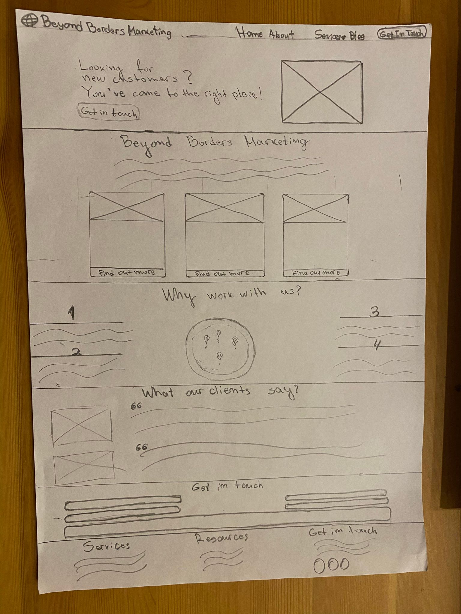
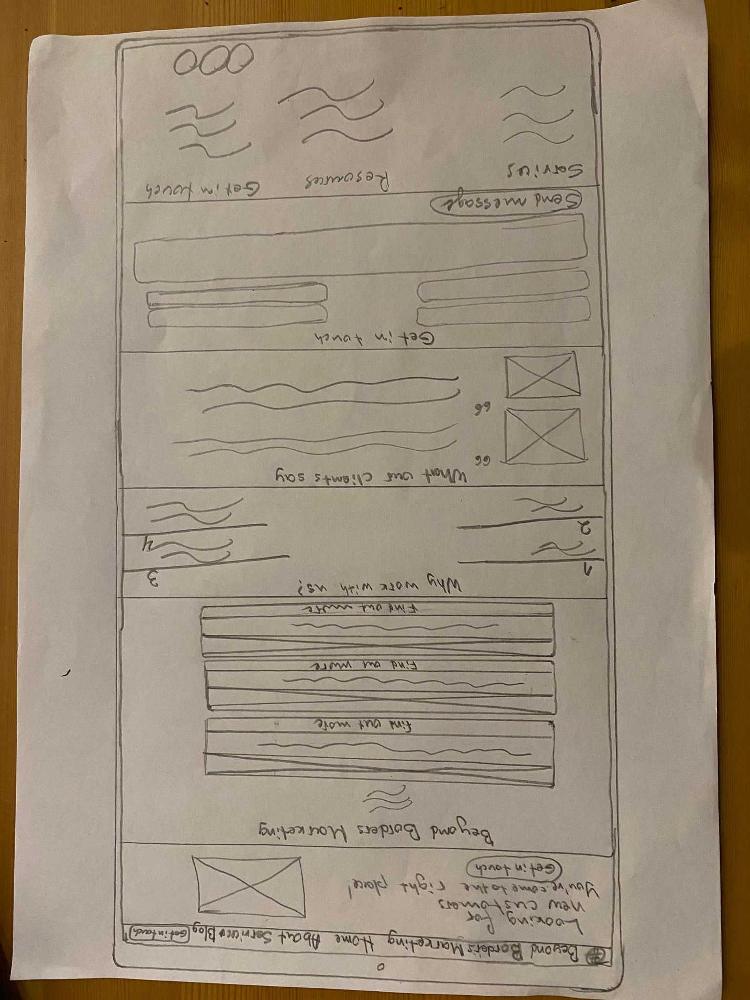
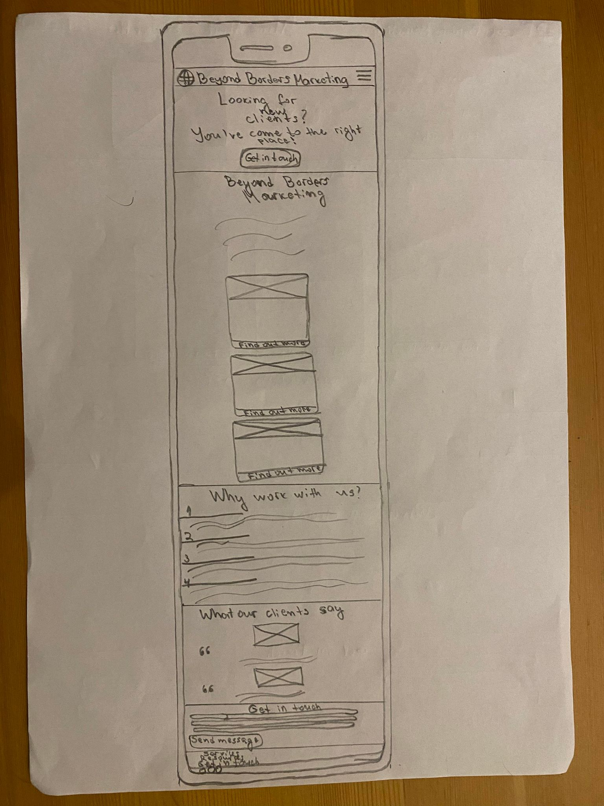
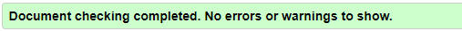
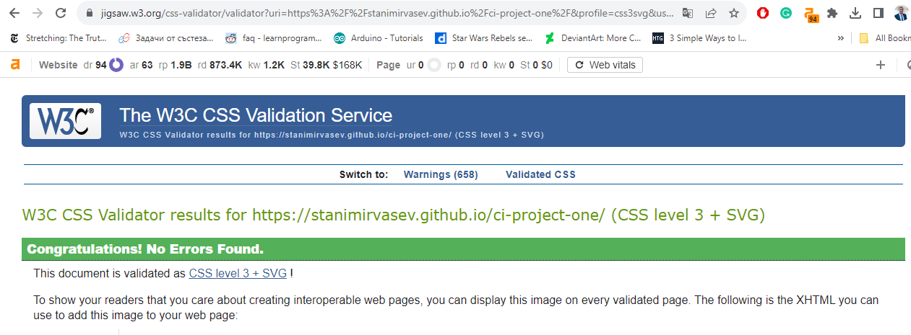
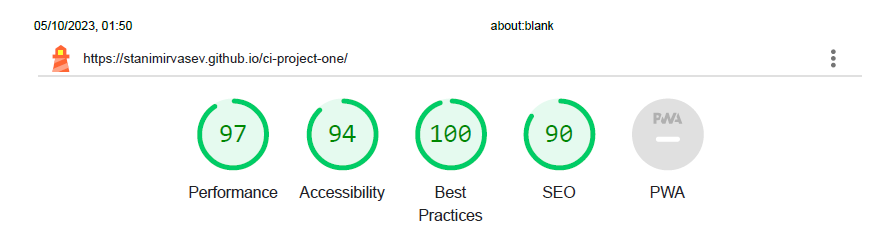

# Beyond Borders Marketing Website

Beyond Borders Marketing is a fictional full-service digital marketing agency offering search Engine Optimisation (SEO), Pay-per-click advertising (PPC) and Conversion rate optimisation (CRO) to businesses internationally.

It is targeted to businesses looking for new customers, whether B2B or B2C. The main goal is to produce quality content and improve web design, use paid advertising platforms to generate traffic from social media platforms and search engines and then optimise the landing pages for maximum conversions.

# Table of contents

1. User Experience (UX)

- Project goals
- Business goals
- Customer goals
- User stories

2. Design choices

- Images/videos used
- Colours used
- Typography

3. Wireframes

- Home page wireframes

4. Features

- Existing features
- Future features

5. Technologies used

- Programming Languages used
- Libraries and frameworks used

6. Testing

- W3C validator testing
- Manual testing
- Lighthouse testing
- Known bugs

7. Deployment

- How the site was deployed

8. Credits

- Content
- Code
- Media library

# User Experience (UX)

- **Project goals:**

  - The main goal for this project is to develop a responsive website for the full-service digital marketing agency Beyond Borders Marketing, which will help the business highlight it's offerings and attract potential clients who want to expand their businesses via digital solutions.

- **Business goals:**

  - The primary business goal is to attract new users to their new easy-to-use website, build their trust through quality content and trustworthy testimonials, and generate warm leads for the sales team to convert over the phone.

- **Customer goals:**

  - The main reason why customers would land on this website is due to the fact that they're struggling to expand their business internationally and/or find new customers in their local markets. Here is where Beyond Borders Marketing comes in as the perfect solution as it offers full-service digital solutions and the client wouldn't need to worry about digital marketing or using multiple agencies that work in silos.

  - **User stories:**

    - First time visitors will be able to:

      - Quickly scan the home page to understand the unique value proposition, service offerings and find relevant testimonials from past clients to remove any concerns.
      - Seamlessly navigate between the various sections on the website to find out more information about each service offering.
      - Easily find contact information and get in touch via a contact form if they prefer online communications.
      - Easily find the business location and social media platforms.

    - Returning visitors will be able to:
      - Browse latest blogs to help them understand the latest developments of SEO, CRO or PPC marketing free of charge.
      - Revisit the information about specific services Beyond Borders Marketing offers before they make a purchase decision. As B2B customers' sales cycle tends to be longer, the website will highlight various content types such as blog posts, podcasts, reports to appeal to audiences that vary in their consumption of content.

# Design choices

- **Images/videos used:**

  - The hero image was created in Canva by the developer and was specifically designed to highlight digital solutions and data graphs as it's related to SEO, CRO and PPC.
  - The services images were created in Canva by the developer and illustrate the different services. Each illustration explains the specific offering. This makes it easier for users to understand what the offering is about without reading any of the text. As users' attention is getting smaller and more difficult to win in recent years, the images are simplyfing the journey for people who tend to skim through content quickly.
  - The location.mp4 video was created in Canva by the developer with the intent to highlight the fact that Beyond Borders Marketing is a digital marketing agency which caters to a global audience (to be exact, it covers over 5 continents).
  - Testimonial images were taken from LinkedIn with permission of the people involved.

- **Colours used:**

  - The colour palette (orange, black, white, grey) was chosen by the developer as it conveys a modern and bold aesthetic while ensuring high readability and contrast, making it visually appealing and user-friendly.

- **Typography:**
  - Two fonts were used throughout this website: Montserrat and Lato. Both were imported by Google Fonts. The selection of Montserrat and Lato was made because they are known for their versatility and compatibility, making them a perfect pair for this website. Montserrat's clean lines and geometric shapes complement Lato's rounded, humanist letterforms, creating a balanced and visually appealing combination that contributes to a cohesive and modern aesthetic across the website.

# Wireframes

- **Home page wireframes**

  
  
  

# Features

### Existing features

- **F01 Navbar:** The company's logo is included on the left side of the screen so it can have enough space to 'breath' and people can click on it to go to the home page. The navbar also includes 5 other elements (Home, About, Services, Blog and Get in touch). The navbar is responsive and includes burger toggler on mobile devices.

- **F02 Masthead section:** The masthead includes text that speaks directly to the user's main painpoint and a call-to-action button that makes it easy for people to get in touch with the company. The button changes once hovered onto to improve user experience. On the right side, it includes an image that illustrates digital solutions in the brand's colours to match the design of the website.

- **F03 Services section:** The services section includes description of the company and it's unique value proposition and 3 columns for the company's offerings (SEO, PPC, CRO) with each column including a specifically designed image to highlight the service itself, description and service explanation, with a call-to-action button to find out more. The find out more button was designed to change once hovered onto to improve user experience. All 3 columns were made to align no matter how long the text was in each one of them to ensure consistency in the design of the website.

- **F04 Why work with us section:** This section includes 5 components - 4 text areas that describe the specific reasons why clients should choose Beyond Borders Marketing as their preferred digital marketing agency and a video of earth rotating to strengthen the idea that it's a global agency with clients around the world.

- **F05 What our clients say section:** This section includes 2 client testimonials, each one of them containing an image that is displayed as a hexagon, an quote icon from Font Awesome and description of what the client has benefitted from working with the agency.

- **F06 Get in touch section:** This section offers an easy way for users to get in touch with the agency without the need to email them. It includes 5 mandatory fields to fill before the message can be submitted which will help the agency to identify those people and store in their CRM platform. Those fields include placeholder text to make it easier on the user to understand what to input on there. The call-to-action button also changes once hovered onto to improve user experience.

- **F07 Footer:** The footer includes 3 columns that include Services (and each individual offering), Resources and Get in touch section which includes contact information and social media links. It also includes a copyright section at the bottom. Each link changes colour to orange once hovered onto to improve user experience as it makes the website more interactive.

### Future features

- **Possible features include:**
  - Component about 'Our team' listing each individual team member and their experience and linkedin profiles.
  - Create a Resources section which contains blogs, podcasts, webinars, reports & papers sections.
  - Different pages for SEO, PPC, CRO.

# Technologies used

- **Programming languages used:**

  - HTML5
  - CSS3
  - Javascript

- **Libraries and frameworks used:**
  - Bootstrap 4.2.1 was utilised for its responsive grid system and pre-designed UI components, ensuring a mobile-friendly and visually consistent website layout.
  - Font Awesome was incorporated to easily integrate scalable vector icons, enhancing the website's visual appeal and user experience with a wide range of icon options.
  - Google Fonts was usedto access a diverse selection of web fonts, allowing for creative typography choices and improved readability.
  - GitHub was used to streamline version control.

# Testing

### W3C validator testing

- [HTML validator](https://validator.w3.org/): 
- [CSS validator](https://jigsaw.w3.org/css-validator/): 

### Manual testing

- I have rigorously tested the website's responsiveness using Chrome Developer Tools. The website seamlessly adapts to various screen sizes, ensuring a smooth user experience across all devices. While it excels on desktop, it also delivers a great performance on mobile and tablet screens.

### Lighthouse

- I utilised Lighthouse within Chrome Developer Tools to comprehensively analyse various aspects of my website, including SEO, accessibility, performance, and best practices. The results from these tests ensure that my website meets high-quality standards across the board. You can find the results below:
  

### Known Bugs

- When hovering onto each individual service offering from the Services section on the navbar, the background colour doesn't align with the dividers.

- Missing blog, SEO, CRO, PPC individual pages.

- Submit a message call-to-action button at the bottom of the Get in touch section isn't functional as it requires server-side script to receive the data once submitted and process it.
- The location.mp4 video flickers once you scroll on the page but works perfectly once standing still on the page. I couldn't figure out how to fix this.

# Deployment

## How the site was deployed

- The site was deployed by using GitHub Pages. You can replicate this process by going to [Link](https://github.com/StanimirVasev/ci-project-one), click on the 'Settings' tab, then select 'Pages' on the left side.
- Under 'Build and deployment' section, select 'Deploy as a branch' as the Source.
- Select 'main' as the branch and '/(root)' as the folder and click 'Save'.

# Credits

## Content

- The content on the page was created by the developer but was inspired by various digital marketing agencies including [Web Marketer UK](https://webmarketeruk.com/), [Coast Digital](https://www.coastdigital.co.uk/) and others.

## Code

- Code in the why work with us is very similar to the code from the Love Running project from the Code Institute.

- The Javascript code used for the hamburger toggler in the navigation was achieved with the guidance from Web Dev Tutorials [youtube channel](https://www.youtube.com/watch?v=flItyHiDm7E).

- The hexagon shaped images from the 'What our clients say' section were inspired by Coding Artist [youtube channel](https://www.youtube.com/watch?v=ovXZ5_vIiUI).

## Media library

- Icons were imported from [Font Awesome](https://fontawesome.com/).
- The Montserrat and Lato fonts were imported from Google Fonts. [Montserrat link](https://fonts.google.com/specimen/Montserrat?query=montserrat), [Lato link](https://fonts.google.com/specimen/Lato?query=lato).
- Images and videos were created by the developer using [Canva](https://www.canva.com/).
